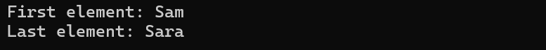

# CS303Assignment2

## Part 1
This project implements a Single Linked List in C++, which provides several common operations found in the standard list class. 

### Data Members
- head: A pointer to the first node of the list.
- tail: A pointer to the last node of the list.
- num_items: Tracks the number of items in the list.
  
### Function Members
- Constructor: Single_Linked_List();
- Destructor: ~Single_Linked_List();
- bool empty() const; - Returns true if the list is empty
- void push_front(const Item_Type& item); - Inserts a new node given the item to the front of the list
- void push_back(const Item_Type& item); - - Inserts a new node given the item to the back of the list
- void pop_front(); - Removes the first node from the list
- void pop_back(); - Removes the last node from the list
- Item_Type& front() const; - Returns the value of the first item in the list
- Item_Type& back() const; - Returns the value of the last item in the list
- void insert(size_t index, const Item_Type& item); - Inserts a new node containing the item at the specified index
- void remove(size_t index); - Removes a node at the specified index
- size_t find(const Item_Type& item) const; - Returns the index of the first occurrence of item in the list

### Implementation
1. Create a Single_Linked_List of strings
   
'''

    Single_Linked_List<string> myList;

'''

2. Using the empty() function member
   
'''

    if (myList.empty()) 
        cout << "The list is currently empty." << endl;
          
'''

Output:

'''
    

'''

3. Pushing elements to the front of the list

'''

    myList.push_front("Sam");
    myList.push_front("James");

'''

Output:

'''
    

'''

4. Pushing elements to the back of the list

'''

    myList.push_back("Sara");
    myList.push_back("Alice");

'''

Output:

'''
    

'''

5. Removing the element at the front of the list

'''

    myList.pop_front();

'''

Output:

'''
    

'''

6. Removing the element at the back of the list

'''

    myList.pop_back();

'''

Output:

'''
    

'''

7. Inserting elements at specific positions

'''

    myList.insert(1, "Henry");
    myList.insert(1, "Theo");

'''

Output:

'''
    

'''
   

   a.  Trying to insert an element out of bounds

'''

    myList.insert(5, "Olivia");

'''

Output:

'''
    

'''

8. Removing an element

'''

    if (myList.remove(1))
        cout << "Given element removed successfully.";
    else
        cout << "Unable to remove provided element";

'''

Output:

'''
    

'''

9. Accessing Front and Back element

'''

    cout << "\nFirst element: " << myList.front() << endl;
    cout << "Last element: " << myList.back() << endl;

'''

Output:

'''
    

'''

10. Finding an element

'''

    int saraIndex = myList.find("Sara");
    cout << "Sara is at index " << saraIndex << endl;

'''

Output:

'''
    

'''

## Part 1
This project implemenst a stack of integers using a vector with push and pop operations.
Performs the following operations:
    1) Create a stack object.
    2) Check the stack is empty or not.
    3) Insert some integer values onto the stack.
    4) Remove an element from the stack.
    4) Find the Top of the stack.
    6) Find average value of the stack elements
  
Files Included
- Question2.h: The header file defining the Vector_Based_Stack class.
- Question2.cpp: The implementation of the Vector_Based_Stack class.

### Function Members
- bool empty() const; - Check if the stack is empty or not
- void push(int element); - Insert elements to the top of the stack
- void pop(); - Remove element from the top of the stack
- const int top() const; - Return the top element of the stack
- size_t size() const; - Return the size of the stack
- int findAverage(); - Find average value of the stack elements.
- void printStack(); -  Print the stack elements

1. Create a Single_Linked_List of strings
   
'''

    Vector_Based_Stack myStack;

'''

2. Using the empty() function member
   
'''

    if (myStack.empty())
        cout << "\nThe stack is currently empty." << endl;

          
'''

Output:

'''
    

'''

2. Pushing elements on to the stack
   
'''

        myStack.push(10);
        myStack.push(20);
        myStack.push(30);
        myStack.push(40);
        myStack.push(50);
        myStack.push(60);

          
'''

Output:

'''
    

'''

3. Popping the top element
   
'''

        myStack.pop();

          
'''

Output:

'''
    

'''

4. Access top element
   
'''

        cout << "\nTop Element: " << myStack.top() << endl;

          
'''

Output:

'''
    

'''

5. Printing the size of the stack
   
'''

        cout << "\nThe size of the stack is " << myStack.size() << endl;

          
'''

Output:

'''
    

'''

6. Computing the average of the stack
   
'''

        float avg = myStack.findAverage();
        cout << "The average of the stack is " << avg << endl;

          
'''

Output:

'''
    

'''
